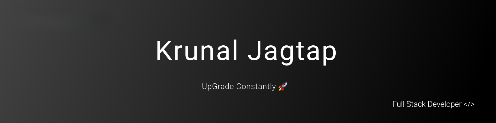

<!-- Banner -->

  
  
    

    
<!-- About Me -->

###  Hello there !

- Bachelor of Computer Applications ( BCA ) 

- Learning Full Stack Development From COHORT  

- Check My - <a href="https://simple-dev-blogs.netlify.app/" target="_blank">Simple Deveploment Blogs ↗️</a>

--- 

### Tech Stack

    
    

    
### GitHub Stats
 

---
